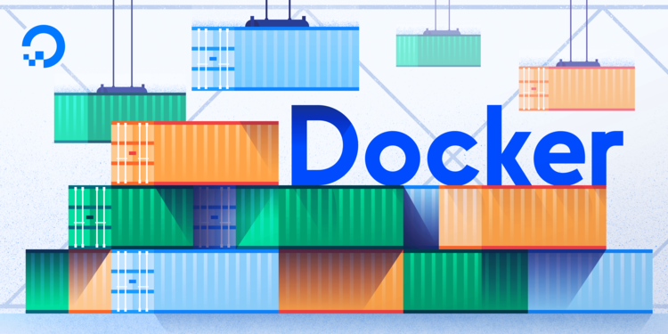

# Container Technology 2025
## Containerized Application for Data Science

**Motivation**
A key aspect of a data scientist’s work involves managing and maintaining a reliable development environment. Keeping the development environment up-to-date and closely aligned with the production environment ensures smoother workflows. When these environments diverge, issues can quickly arise. In larger settings, proficiency with CI/CD pipelines and DevOps practices becomes highly beneficial. A data scientist’s primary goal is to deliver solutions that are easy to integrate and deploy into production seamlessly.

## Course Summary

### Overview Container Technology
* [Overview Containe Architecture](./overview/architecture.md)
### Part 1 installation
* [Install Native Python](part_1_installation/1_install_python.md)
Learn how to install and configure a native Python environment on your system, enabling the use of Python directly without additional tools.
* [Install Conda Environment](part_1_installation/2_install_conda.md)
A guide to setting up Conda, a versatile environment and package manager, which helps manage dependencies and isolate projects seamlessly.
* [Install Docker Desktop](part_1_installation/3_install_docker.md)
Step-by-step instructions for installing Docker Desktop on Windows, providing a containerized environment for consistent and reproducible workflows.
### Part 2 Docker Jupyter
This section dives into leveraging Docker for data science, with a focus on JupyterLab and Docker Compose for streamlined workflows.
* [Install Docker For Data Science](part_2_docker_jupyter/1_dockercomposejupyter.md)
Instructions for setting up a Docker environment specifically designed for data science tasks, complete with JupyterLab.
* [Explain DataScience Dockerfile](part_2_docker_jupyter/2_dockerfile1.md)
An in-depth explanation of the Dockerfile designed for data science, detailing the configurations and tools included to optimize productivity.
* [Migrate to Docker compose](part_2_docker_jupyter/3_docker_compose.md)
Learn how to use Docker Compose to manage multi-container applications, making it easier to handle complex setups for data science projects.

