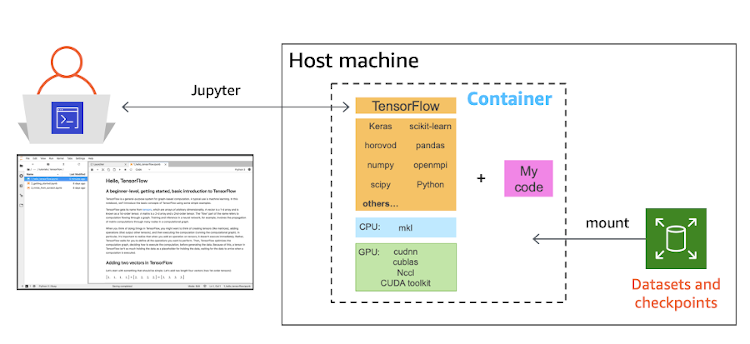

#Section 1 Overview Container Architecture

## Containers vs Virtual Machines
Virtual machines (VMs) and containers are two modern frameworks that have significantly transformed how virtualization is perceived in the software industry. Both enable the movement of workloads across different physical devices, and they are often used together rather than being mutually exclusive.

The main distinction between containers and virtual machines lies in how they implement virtualization. Virtual machines virtualize an entire system, including the hardware, by using a hypervisor. This means that each VM includes its own operating system and resources. In contrast, containers virtualize only the software layers above the operating system, sharing the host OS’s kernel. As a result, containers are more lightweight and efficient, but they rely on the host system’s operating environment for execution.

A container as a virtual machine has isolation, that is, a space reserved for data processing, authorization as root, can mount file systems and more. However, unlike virtual machines that are managed with separate operating systems, the containers share the kernel of the host system with other containers, as shown in the following diagrams.

!!! note "What is a hypervisor"

    A hypervisor is specialized software that emulates a client PC along with all its hardware resources. It operates on physical computers, also known as host machines. There are two types of hypervisors: hosted and bare-metal. A hosted hypervisor relies on an existing operating system to run and does not directly manage hardware drivers. In contrast, a bare-metal hypervisor runs directly on the host hardware, without needing an underlying operating system.

## Why use Docker containers for Data  development with Jupyter lab?

Docker containers for data development with Jupyter Lab offer a consistent, isolated environment that ensures reproducibility, simplifies dependency management, and allows easy sharing of setups across different systems. Containers streamline the setup process, avoid version conflicts, and ensure that the development environment closely matches production.

Using Docker containers for data development with Jupyter Lab provides several key advantages:

1. **Isolation**: Docker containers create an isolated environment for your Jupyter Lab and its dependencies, preventing conflicts with other software or projects running on your system.

2. **Reproducibility**: Docker ensures that the environment is the same across different machines, which means that code and notebooks developed in one container will work the same way on any other system with the same container.

3. **Consistency**: Containers encapsulate all dependencies and configurations, so your development environment is consistent, regardless of where the container is run (locally, in the cloud, or on a server).

4. **Easy Setup**: Docker simplifies the setup process for Jupyter Lab and other data science libraries, saving time by avoiding the need to manually install and configure packages and dependencies.

5. **Portability**: Once a Docker container is created, it can be shared with colleagues or collaborators, ensuring that everyone uses the same environment and eliminates "it works on my machine" issues.

6. **Scalability**: Docker enables easy scaling and management of multiple containers, which is useful for large datasets or distributed computing tasks in data science workflows.

7. **Integration with CI/CD**: Docker containers can be integrated into continuous integration and deployment pipelines, ensuring that your data science projects are always tested and deployed in consistent environments.

8. **Efficiency**: Containers are lightweight compared to traditional virtual machines, allowing faster startup times and efficient use of system resources, making them ideal for data science tasks where resources may vary.

By using Docker with Jupyter Lab, you streamline your development process, improve consistency across environments, and enhance collaboration.

## What is Jupyter Lab?

Jupyter Lab is an open-source, interactive development environment (IDE) designed for data science, machine learning, and scientific computing. It provides a web-based interface where users can create and manage Jupyter notebooks, text editors, terminals, and custom dashboards, all within a single unified environment.

### Key Features of Jupyter Lab:

- **Interactive Notebooks**: Users can create and execute Jupyter notebooks, which combine code, visualizations, and documentation in a single document.

- **Multi-File Interface**: Jupyter Lab allows for working with multiple files simultaneously, such as notebooks, scripts, and data files, making it easier to organize and manage projects.

- **Extensibility**: Jupyter Lab supports a wide range of plugins and extensions, allowing customization to suit various workflows, such as adding support for new languages or advanced visualization tools.

- **Real-Time Collaboration**: It facilitates collaboration by allowing multiple users to work on the same notebook in real-time (with additional plugins).

- **Support for Multiple Languages**: While Jupyter Lab is most commonly used with Python, it supports multiple languages such as R, Julia, and others via kernels, making it flexible for a variety of data science and scientific computing tasks.

- **Rich Visualizations**: It integrates well with libraries like Matplotlib, Plotly, and others to display interactive and rich visualizations directly within the notebook.

- **Integration with Data Science Tools**: Jupyter Lab can integrate seamlessly with data science libraries like Pandas, NumPy, SciPy, and TensorFlow, making it a powerful tool for analysis and modeling.

Overall, Jupyter Lab is an enhanced, feature-rich interface for Jupyter notebooks that streamlines the process of data analysis, visualization, and reporting in one place.

- visit [Jupyter Official Website](https://jupyter.org/) for more information.

# Discuss:

# Q&A: Container Architecture & Jupyter Lab

### Q1: What is the main difference between containers and virtual machines?
**A1:** The main difference between containers and virtual machines lies in how they implement virtualization. Virtual machines virtualize an entire system, including the hardware, using a hypervisor, and each VM includes its own operating system. Containers, on the other hand, virtualize only the software layers above the operating system, sharing the host OS's kernel. As a result, containers are more lightweight and efficient, but rely on the host system's kernel for execution.

### Q2: What is a hypervisor, and what are the two types of hypervisors?
**A2:** A hypervisor is specialized software that emulates a client PC and all its hardware resources. It operates on physical computers (host machines). There are two types of hypervisors:
1. **Hosted Hypervisor**: Runs on top of an existing operating system and does not directly manage hardware drivers.
2. **Bare-metal Hypervisor**: Runs directly on the host hardware without the need for an underlying operating system.

### Q3: Why should Docker containers be used for data development with Jupyter Lab?
**A3:** Docker containers offer several advantages for data development with Jupyter Lab:
- **Isolation**: Ensures that Jupyter Lab and its dependencies are isolated from other software.
- **Reproducibility**: The environment is the same across different systems, ensuring code consistency.
- **Consistency**: Encapsulates all dependencies and configurations, ensuring a consistent development environment.
- **Easy Setup**: Simplifies the installation and configuration of Jupyter Lab and related libraries.
- **Portability**: Containers can be shared and used across different environments.
- **Scalability**: Easily scale and manage containers, ideal for large datasets and distributed computing tasks.
- **Efficiency**: Lightweight containers are faster to start and use fewer resources compared to virtual machines.

### Q4: What is Jupyter Lab, and what are its key features?
**A4:** Jupyter Lab is an open-source, interactive development environment for data science, machine learning, and scientific computing. It provides a web-based interface for creating and managing Jupyter notebooks, text editors, terminals, and custom dashboards. 

**Key features include:**
- **Interactive Notebooks**: Combine code, visualizations, and documentation.
- **Multi-File Interface**: Work with multiple files such as notebooks, scripts, and data files simultaneously.
- **Extensibility**: Support for plugins and extensions to customize the environment.
- **Real-Time Collaboration**: Allows multiple users to work on the same notebook in real-time.
- **Support for Multiple Languages**: Supports Python, R, Julia, and others.
- **Rich Visualizations**: Integrates with visualization libraries like Matplotlib and Plotly.
- **Integration with Data Science Tools**: Seamless integration with libraries like Pandas, NumPy, SciPy, and TensorFlow.
