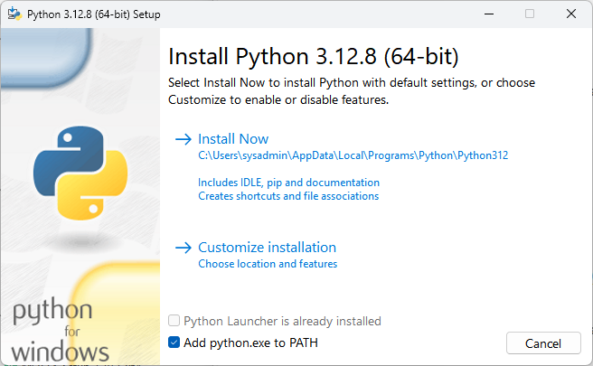
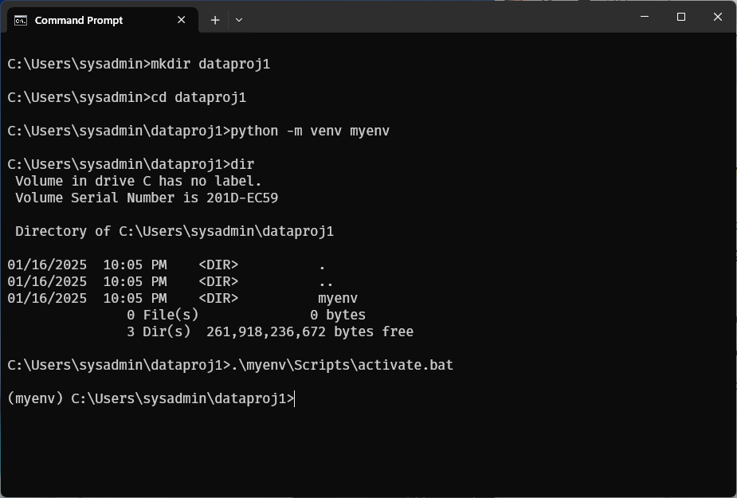
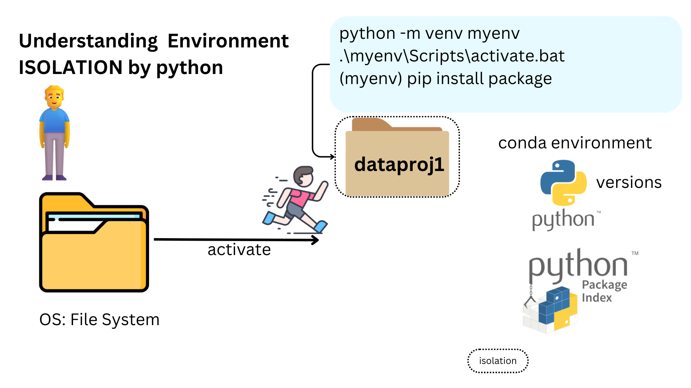
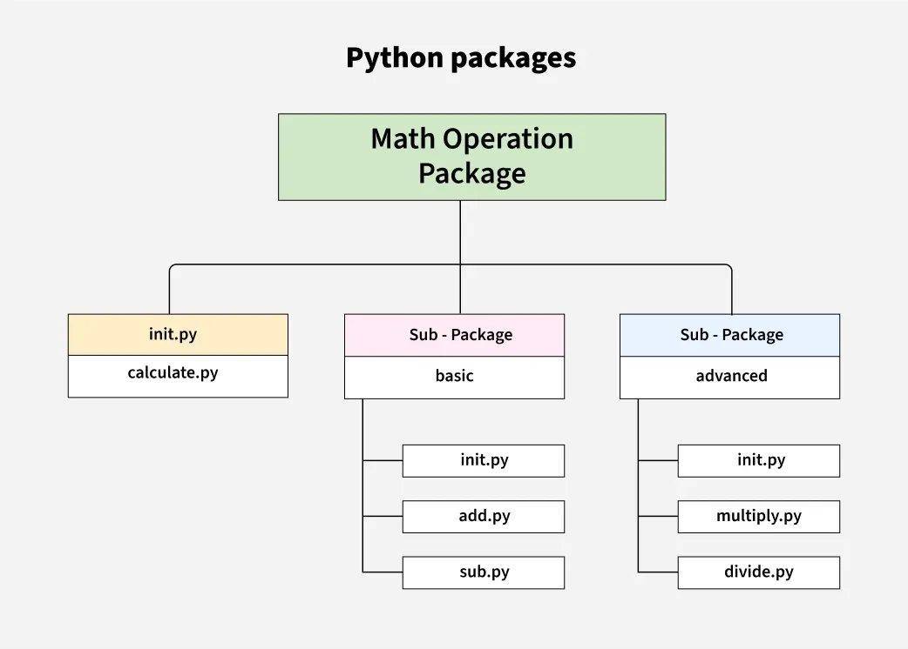

# **Section 1**  Setup Environment 
## Install Native Python
**Step 1. Downloading the pthon installer**  
1. Go to official  [https://www.python.org/downloads/](https://www.python.org/downloads/)  
2. Download the latest or previous versions of Python for Windows 64bit (3.13,3.12), including installers

  

1. After the installer is downloaded, double-click the `.exe` file `python-3.13.1-amd64.exe, python-3.12.8-amd64.exe`  
1. Select the install launcher for all user, eanbles all users for the computer to access to the python   
1. Select the python.exe to PATH checkbox, which enables users to launch python from command line


!!! type "Python Directory"
    **Before you start, learning about python directory**:  
    locate the Python installation directory on your system. The following directories are examples of the default directory paths:

    **C:\Program Files\Python313**: if you selected (User admin priviledges)  Install for all users during installation, then the directory will be system wide
    **C:\Users\"username"\AppData\Local\Programs\Python\Python313**: if you didn’t select Install for all users during installation, then the directory will be in the Windows user path

  
## Discuss: Python Environment:


## Start Install process
1. Installing

Successfull install


## Setup python environment 


## Verify python  
we can verify python installation by command line. Start to use command line from windows. open windows cmd or powershell. run command belows
```
python --version
where python
```


## Install package with command pyhon -m pip 
```
python -m pip install tersorflow
```
from output below there is ERROR: say Could not find a version that satisfies the requirement tensorflow version 


let goto [https://pypi.org/project/tensorflow/](https://pypi.org/project/tensorflow/)


**Interesting we can install numpy package:**  
The error occurs because TensorFlow currently does not support Python 3.13. TensorFlow's development cycles typically lag behind the latest Python versions, and support is usually added after thorough testing.


## Next Step: we reinstall python 3.12
we want to install tensorflow again. We will install tersorflow to python 3.12. Let download python 3.12:


continue process installation:



Success install:


Let Change python environment to python312:


Verify new python version and install tensorflow again:


we will see the result: Successfully install package:


## Create python project
create normal folder and change folder to python project with environment

1. create folder with `mkdir` command and move to folder with `cd ` command  
2. create python virtal enviroment with command `python -m venv myvenv` in project directory

3. activate pthon envionment with `.\myenv\Scripts\activate.bat`

we will see the indicator `(myenv)` whick show the corrent environment we reside.

Discuss: install package in environment

isolation:


## Key Python Package for DataScience
key packages in Python for Data Science and Machine. 
1. Pandas
2. Numpy
3. Scikit Learn
4. Matplotlib
5. Seaborn

We have a foundation in Python, so it's essential to explore various Python packages such as numpy, pandas, and matplotlib, as well as Python modules like math, random, and datetime. In the Python ecosystem, both modules and packages serve as tools to organize and structure code based on different purposes.



### Difference Between Packages and Modules in Python

| **Aspect**        | **Module**                                        | **Package**                                      |
|--------------------|--------------------------------------------------|-------------------------------------------------|
| **Definition**     | A single Python file containing code (functions, classes, etc.). | A collection of modules organized in a directory with an `__init__.py` file. |
| **Structure**      | A `.py` single file.                             | A directory containing an `__init__.py` file and one or more modules. |
| **Purpose**        | To group related code together.                  | To organize multiple modules into a hierarchical structure. |
| **Example**        | `math`, `random`, `datetime`                     | `numpy`, `pandas`, `matplotlib`                |
| **Use Case**       | Lightweight organization for smaller functionality. | Manage larger projects with complex dependencies and modularity. |
| **How to import**  | import module_name                               |  import package_name.module_name |

### Key Concepts and Purposes

#### Modules:
- Provide a way to reuse code in a single file.
- Focus on a specific functionality (e.g., math operations, random number generation).
- **Example**: Importing a single module:
```python
  import math
  print(math.sqrt(16))  # Output: 4.0
```
### Packages:
- Group related modules together to create a larger, well-organized library.
- Enable a hierarchical structure for large-scale applications.
- **Example**: Importing a module from a package:
```python
  import numpy.linalg
  print(numpy.linalg.norm([3, 4]))  # Output: 5.0
```