# **Section 2** Conda Environment
conda is a powerful package, dependency, and environment management tool widely used in Python programming, especially for scientific computing and data analysis. It is commonly associated with the Anaconda (full) and Miniconda (minimal) distributions.

### Objective

- **Successfully Install a Conda Environment**  
  Ensure the Conda environment is installed and properly configured for use.

- **Understand Using Conda Prompt and JupyterLab**  
  Learn how to utilize the Conda prompt for managing environments and running JupyterLab for interactive development.


### Key Features of Conda

#### **1. Environment Management**:
- Create isolated environments for different projects, each with its own Python version and packages.
- Avoid version conflicts and dependency issues.

#### **2. Package Management**:
- Install, update, and manage packages seamlessly.
- Supports Python and non-Python packages.

#### **3. Cross-Platform**:
- Works on Linux, macOS, and Windows.

#### **4. Precompiled Packages**:
- Provides precompiled binaries, reducing installation errors.


## Install Anaconda (Full installation): 
* Download from [Anaconda Office Site](https://www.anaconda.com/download)

* Download Anacona Installers 64-bit Graphical Installer

* Download success

* Start installation

* Accept Licence

* Install Just Me mode
### Installation for a Single User (Normal User)

- **Scope**: Installs Anaconda only for the current user, meaning other users on the same computer won’t have access to the installation.
- **Permissions**: No need for administrator privileges.
- **Directory**: The installation is done in the user's home directory (e.g., `C:\Users\YourUsername\Anaconda3`).
- **Environment Management**: Can create environments and install packages only for that specific user.
- **Use Case**: Ideal for personal use or when we don't have administrative access to the machine (e.g., in a corporate environment).

#### **Steps**:
1. Choose the "Just Me" option during installation.
2. Follow the on-screen instructions.


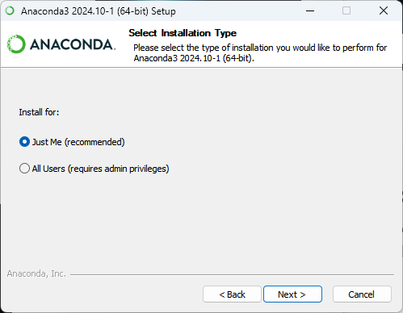
* Install location. Conda will install in user folder
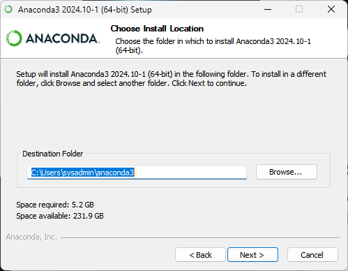
* Select options [/] Register Anaconda3, and [/] Clear the package cache upon completion

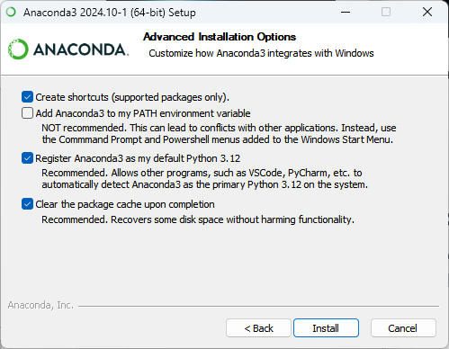
* Wait installing
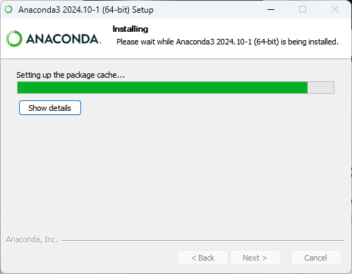
* Complete install

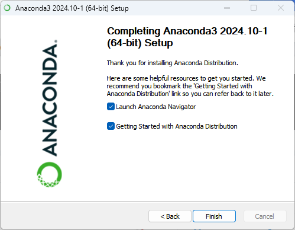
## Open Anaconda Navigator App


* Open anaconda prompt from Navigator
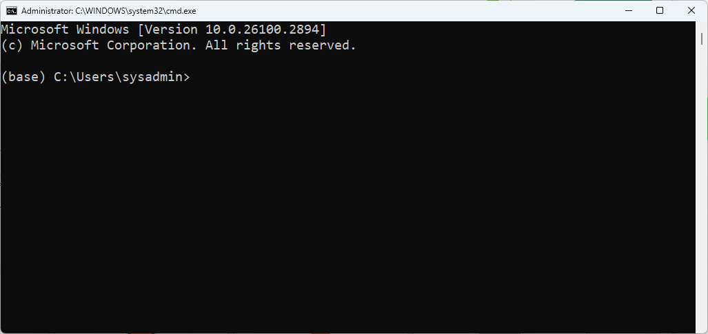
* Run `conda init`
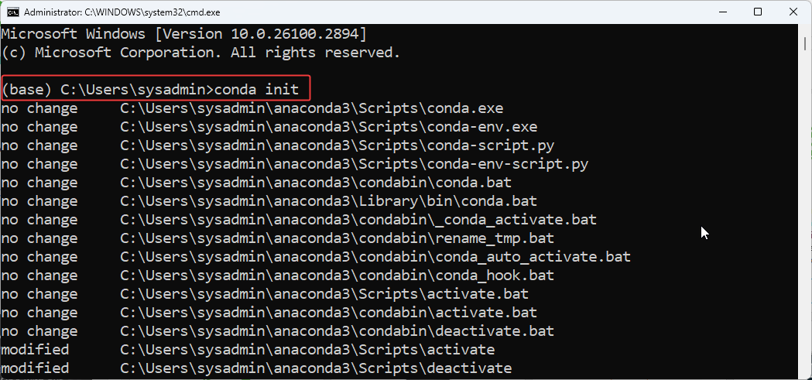

### Why We Have to Run `conda init` After Installation

Running `conda init` after installing Anaconda (or Miniconda) is necessary to configure your shell environment so that Conda commands can be recognized and executed correctly in the terminal.

#### **1. Modifying Shell Configuration**
- **Purpose**: `conda init` modifies the shell's configuration files (like `.bashrc`, `.zshrc`, `.bash_profile`, etc.) to add the necessary environment variables and configurations.
- **Effect**: This ensures that the `conda` command is available globally in the terminal without needing to specify the full path to the Anaconda installation.

#### **2. Activating Conda Base Environment Automatically**
- By running `conda init`, Conda sets up the shell to automatically activate the **base environment** when a terminal is opened. This way, you don’t need to manually activate the base environment every time you start a new terminal session.
  
  Example:
  - Without `conda init`, you'd need to type `conda activate` manually every time.
  - After running `conda init`, the terminal will automatically activate the base environment.

#### **3. Ensuring Proper PATH Configuration**
- Conda needs to be added to the system `PATH` for it to be accessible in any terminal session. `conda init` ensures that the appropriate paths are set up.
  
#### **4. Enabling Conda Environment Activation in Any Shell**
- Conda init ensures compatibility across different shells (bash, zsh, fish, etc.) by setting up the appropriate configurations for each shell. This makes it easier to use Conda on any system with different shell environments.

#### **In Summary**:
Running `conda init` ensures that:
- Conda's commands are available in your terminal.
- The base environment is automatically activated.
- The system is configured to manage multiple environments effectively across different shell types.

We only need to run `conda init` once, after which it will modify the necessary files to enable seamless use of Conda.


## Fix Permision 
```
PermissionError: [Errno 13] Permission denied: 'C:\\Users\\sysadmin\\AppData\\Roaming\\jupyter\\runtime\\jpserver-20464-open.html'
```

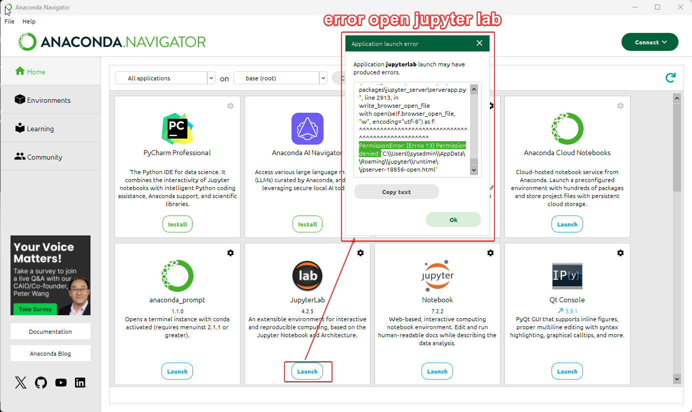

* Close anaconda Desktop and Re open again with Administrator
* Open anaconda prompt:

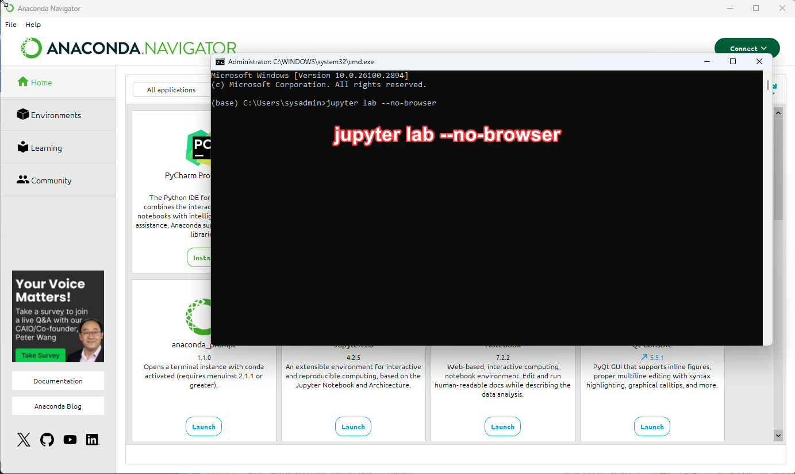

* Copy link to browser

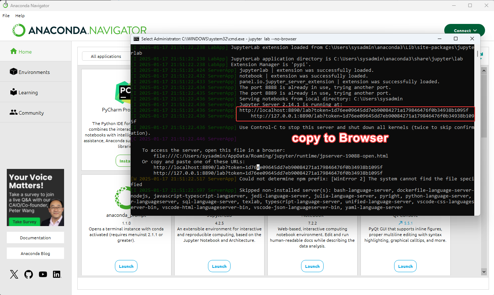

* Jupyter lab web

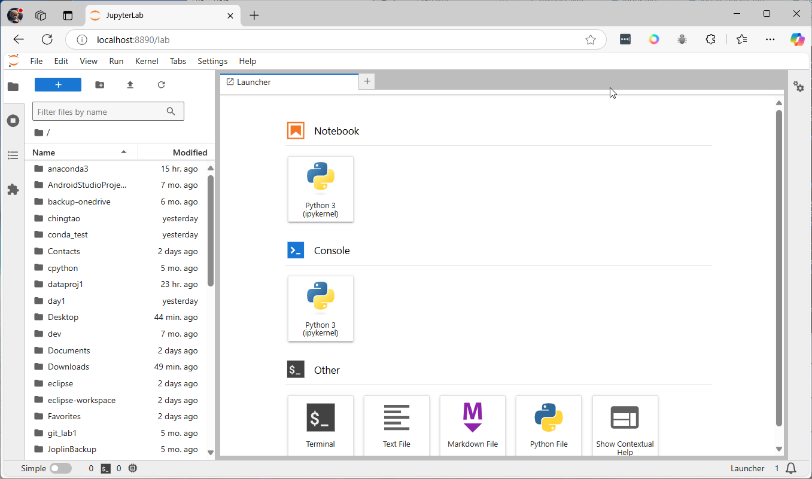


### Update Jupyter Lab
Run this command to ensure your JupyterLab and Jupyter Server are up to date with the latest features, improvements, and security patches. 
```
pip install --upgrade jupyterlab jupyter_server
```


### Create Conda Environment and Activate ###
* Start from (base) environment of Conda
```
(base) conda create -n myenv python=3.12
```
* This creates an environment named `myenv` with Python version 3.12
```
(base) conda activate myenv
```


Accept [y] then enter:

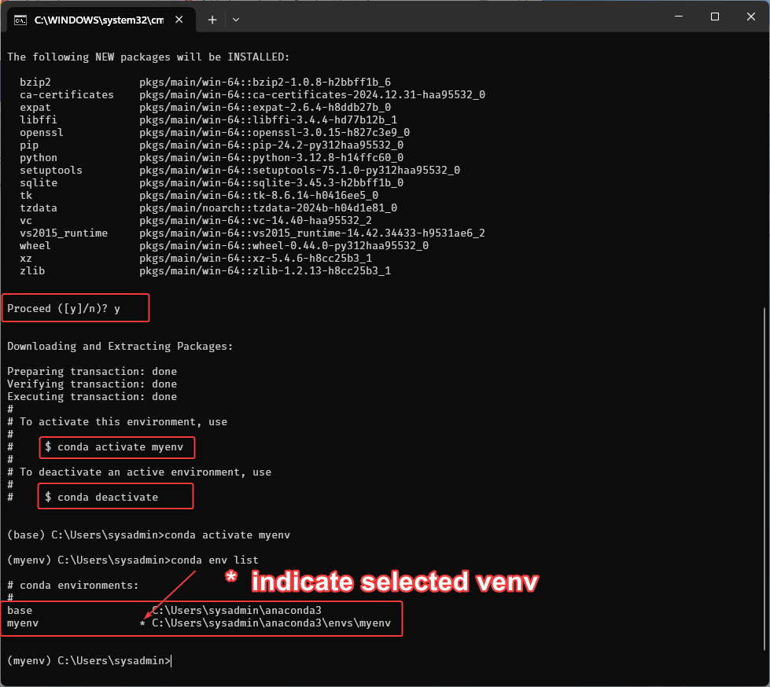

install jupyterlab jupyter-server in myenv
```
(myenv) C:\Users\sysadmin>pip install --upgrade jupyterlab jupyter-server
```

### Summary of Common Conda Commands

| **Command**                          | **Description**                                                                 |
|--------------------------------------|---------------------------------------------------------------------------------|
| `conda create -n <env_name> python=X`| Create a new Conda environment with Python version `X`.                        |
| `conda activate <env_name>`          | Activate the specified Conda environment.                                      |
| `conda deactivate`                   | Deactivate the current Conda environment.                                      |
| `conda env list`                     | List all available Conda environments.                                         |
| `conda remove -n <env_name> --all`   | Delete a specified Conda environment and all its packages.                     |
| `conda install <package_name>`       | Install a package into the currently active Conda environment.                 |
| `conda update <package_name>`        | Update a specific package in the active Conda environment.                     |
| `conda update conda`                 | Update Conda to the latest version.                                            |
| `conda list`                         | List all installed packages in the active Conda environment.                   |
| `conda search <package_name>`        | Search for a package in Conda repositories.                                    |
| `conda info`                         | Display information about the Conda installation.                              |
| `conda clean --all`                  | Remove unnecessary files, caches, and unused packages to free up space.        |
| `conda export > environment.yml`     | Export the active environment to a `.yml` file for sharing or backup.          |
| `conda env create -f environment.yml`| Create an environment from a `.yml` file.                                      |
| `conda config --add channels <name>` | Add a new channel (repository) to Conda configuration.                         |
| `conda config --show`                | Display the current Conda configuration.                                       |
| `conda uninstall <package_name>`     | Uninstall a specific package from the active Conda environment.                |
