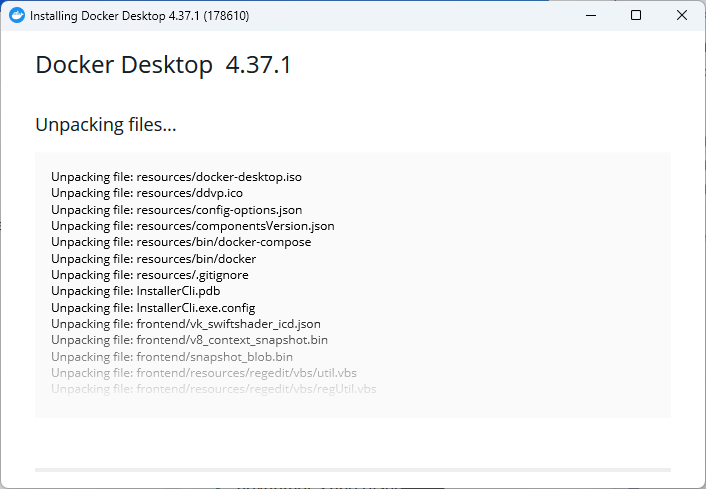
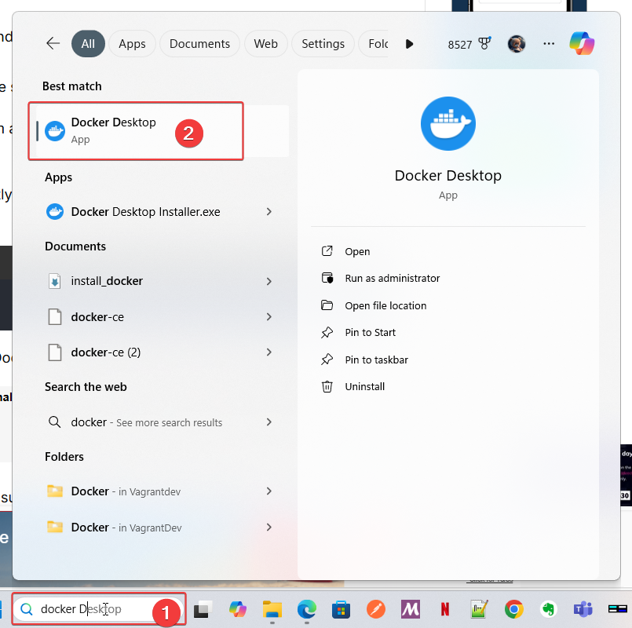

# **Section 3** Install Docker Desktop on Windows

### How to Install Docker Desktop on Windows

#### **Prerequisites**
1. **Supported Windows Version**:
    - Windows 10 64-bit: Pro, Enterprise, or Education (2004 or later).
    - Windows 11: Home, Pro, or Enterprise.

2. **System Requirements**:
    - WSL 2 (Windows Subsystem for Linux) feature enabled.
    - Hardware virtualization enabled in the BIOS.
    - Minimum of 4GB RAM.

3. **Admin Rights**:
    - Administrator access is required for installation.

---

#### **Steps to Install Docker Desktop**

1. **Download Docker Desktop**:
    - Visit the [Docker Desktop Download Page](https://www.docker.com/products/docker-desktop/) and download the installer for Windows.

2. **Run the Installer**:
    - Double-click the downloaded `.exe` file.
    - Follow the installation wizard instructions.

3. **Enable WSL 2**:
    - During installation, ensure **WSL 2** is selected as the default backend.

4. **Restart Your System**:
    - After installation, restart your computer to finalize the setup.

5. **Start Docker Desktop**:
    - Search for "Docker Desktop" in the Start menu and launch the application.
    - Docker Desktop will initialize and verify system compatibility.

6. **Sign In to Docker Hub**:
    - Optional: Sign in with your Docker Hub account or create a new one.

---


## Step1: Enable WSL2

Open PowerShell as Administrator


```
wsl --install
```
This command will:

* install linux (ubuntu) on windows

Access to ubuntu: Search  'ubuntu"


Open Ubuntu Application: will open ubuntu shell


Run: update command
```
cat /etc/lsb-release
apt update && apt full-upgrade -y
```

Step 2: Install Docker Desktop
1. Download [Docker Desktop for windows](https://docs.docker.com/desktop/setup/install/windows-install/) 


2 click installer 



wait for install

3 Success screen, Click close


Step3: verify Docker is install correctly,  open a terminal (Command promp or PowerShell)


```
docker --version
```

4 Open Docker Desktop


Accept

Docker desktop

Enable Terminal


### Ensure WSL2 install 
we can use command below to list WSL install
```
> wsl --set-default-version 2
> wsl --list --verbose
  NAME              STATE           VERSION
* Ubuntu            Stopped         2
  docker-desktop    Stopped         2
```
- Version 2 indicated instance use WSL2 architecture, which includes a real linux kernel
- docker-desktop  is installed in system
- state `Stopped` mean WSL distribution not running

### Start wsl instance
- Start Ubuntu install by command line
```
> wsl -d Ubuntu
```


- Start docker-desktop wsl instance by start docker-destop application
- after start docker-desktop application, open terminal run `wsl --list --verbose`
- See State of WSL is running

