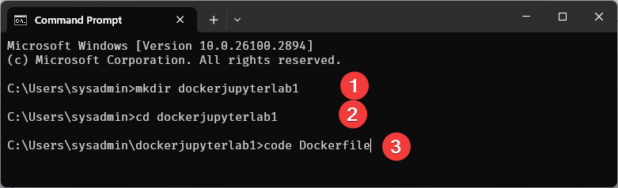
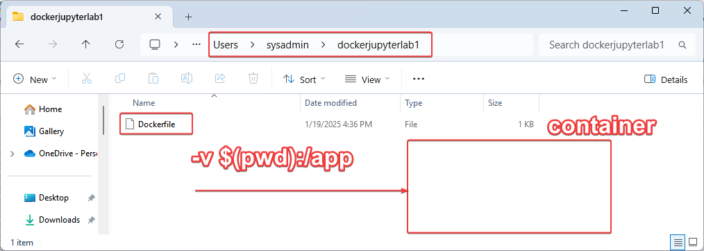
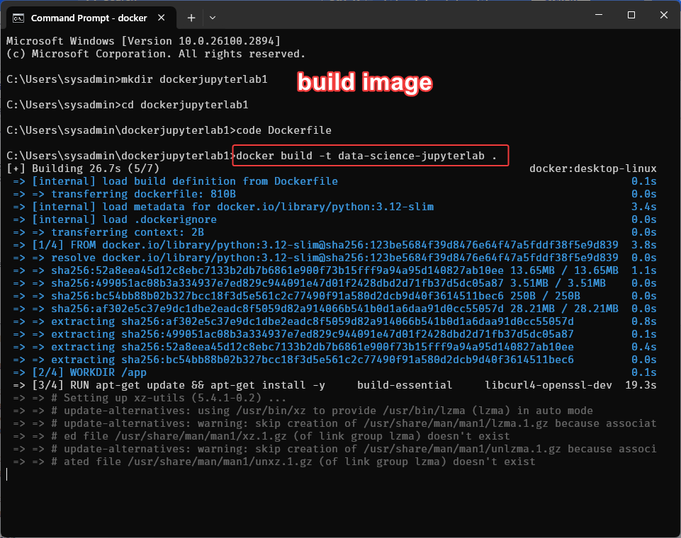
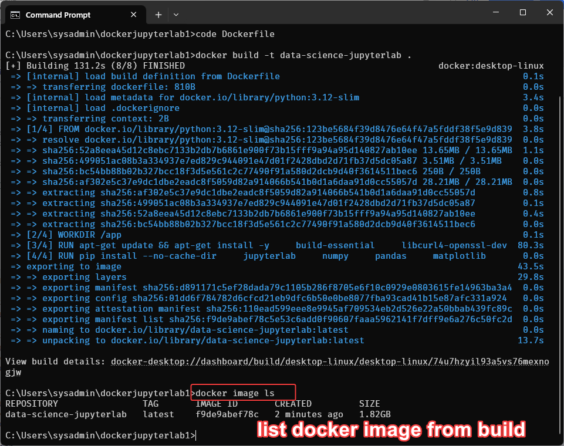
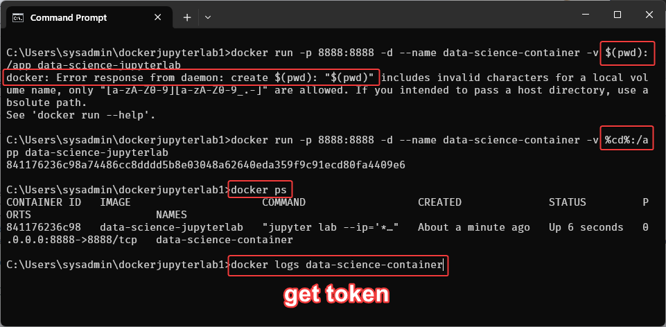
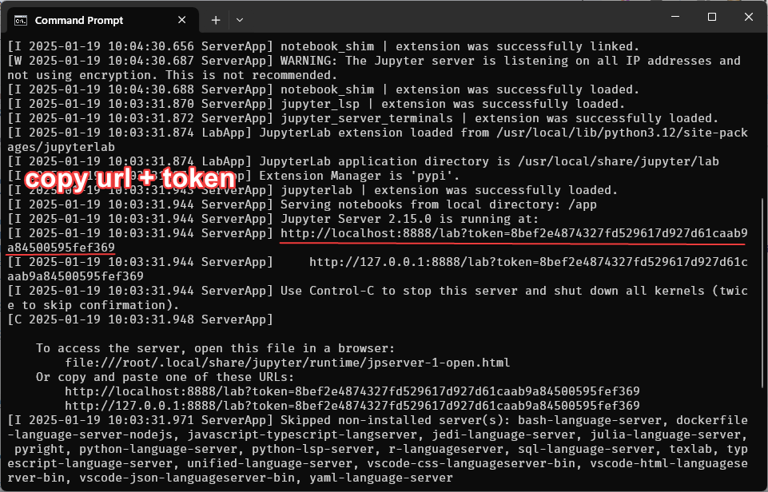
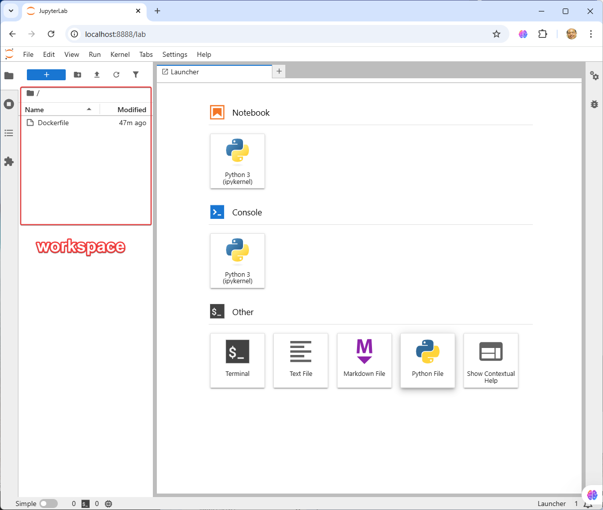
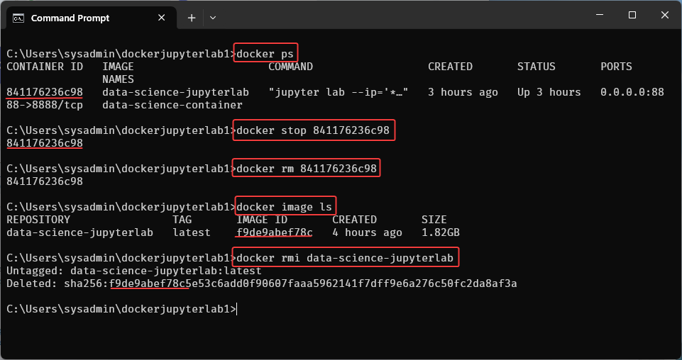

#**Section 1** Docker Engine for Data Science


To design a Docker container for data science that integrates with Jupyter Lab, you can create a custom Dockerfile. This container will include common tools and libraries used in data science, such as Python, Jupyter Lab, and essential data science packages like numpy, pandas, matplotlib, and scikit-learn.

## Back to Basic of Container
Before diving into commands, it's essential to understand some basic concepts:

- **Images**: A Docker image is a read-only template used to create containers. It can include the OS, application code, and libraries.
- **Containers**: A Docker container is a lightweight, executable package that includes everything needed to run a piece of software, such as the code, runtime, libraries, and system tools.


## What is Dockerfile?

A Dockerfile is a script that contains a series of instructions on how to build a Docker image. It defines the steps needed to set up a containerized environment, specifying the base image, installing dependencies, copying files, and configuring how the container will run.


## What is a Container?
The concept of containers originated in the 1970s. Think of a container as an isolated working environment—a virtual server that can be configured from scratch. You can define its properties, such as the operating system, Python interpreter version, and required library dependencies. Containers run by utilizing your machine's resources.

One key feature of a container is that it does not have access to your storage unless explicitly granted permission. A common best practice is to mount specific folders that should be accessible within the container.

**Key Steps in Working with Containers:**
1. **Define the environment**: Create a Dockerfile to specify the container's setup.
2. **Build the image**: Generate a Docker image based on the Dockerfile.
3. **Run the container**: Create and launch a container using the Docker image.

This process is highly shareable, enabling team members to replicate the environment consistently. Containers can be recreated as needed, ensuring reproducibility and efficiency in development workflows.

## Create a Docker Container for Data Science with Jupyter Lab
### **Step1 Create a Dockerfile: First** create a directory for your project and create a Dockerfile within that directory. Here’s how to set it up:
- Create folder dockerjupyter1
- Create Dockerfile with content: inside dockerjupyter1 folder



``` title="Dockerfile"
# Use Python 3.12 as the base image
FROM python:3.12-slim

# Set the working directory in the container
WORKDIR /app

# Install system dependencies for data science packages
RUN apt-get update && apt-get install -y \
    build-essential \
    libcurl4-openssl-dev \
    libssl-dev \
    libffi-dev \
    && apt-get clean

# Install Jupyter Lab and common data science packages
RUN pip install --no-cache-dir \
    jupyterlab \
    numpy \
    pandas \
    matplotlib \
    scikit-learn \
    seaborn \
    scipy \
    plotly \
    && pip install --upgrade pip

# Expose Jupyter Lab's default port
EXPOSE 8888

# Set the default command to launch Jupyter Lab
CMD ["jupyter", "lab", "--ip='*'", "--port=8888", "--no-browser", "--allow-root"]

```
Discuss: mount (connect) file from host system into Docker container


### Explain: Dockerfile

- Click here to read [explaination Dockerfile](../docker_jupyter/dockerfile1.md)

### **Step2 Build and Run**
we have to understand 2 step (Build & Run)
* **Step2.1 Build the Docker image:**
```
docker build -t data-science-jupyterlab .
```
### **Explanation**:
* **-t data-science-jupyterlab**: Tags the image with the name data-science-jupyterlab.
* **.:** Specifies the current directory (which should contain your Dockerfile).

This way, any Jupyter notebooks you have in your current directory will be accessible from within the Docker container.



List image from build:
```
> docker image ls
```


* **Step2.2 Run image:**
    - Run the Docker Container: For linux, macos
```
docker run -p 8888:8888 -d --name data-science-container -v $(pwd):/app data-science-jupyterlab
```
    - Run the Docker Container: For Command prompt
```
docker run -p 8888:8888 -d --name data-science-container -v %cd%:/app data-science-jupyterlab
```

    - Run the Docker Container: For ${PWD}
```
docker run -p 8888:8888 -d --name data-science-container -v ${PWD}:/app data-science-jupyterlab
```


### **Explanation**:
* **docker run**: This command is used to create and start a new container from an image.
* **-p 8888:8888**: Maps port 8888 on your host machine to port 8888 inside the container, which is the default port for Jupyter Lab.
* **-d**: Runs the container in detached mode (in the background).
* **--name data-science-container**: Assigns a name (data-science-container) to the container.
* **-v $(pwd):/app**: Mounts the current directory ($(pwd)) to the /app directory inside the container, so your Jupyter notebooks in the current directory are accessible inside the container.
* **data-science-jupyterlab**: Specifies the name of the Docker image to use.




```
docker logs data-science-container

 http://localhost:8888/lab?token=8bef2e4874327fd529617d927d61caab9a84500595fef369

```


## Easy Access to Jupyter lab

- copy url open in browser
http://localhost:8888/lab?token=8bef2e4874327fd529617d927d61caab9a84500595fef369



## Clean up container before continue...
- Stop Container  
- Clean docker container
- Remove image



### Discuss:
- **Stop a Running Container**
```
docker stop <container_name_or_id>
```
- Replace <container_name_or_id> with the name or ID of the container you want to stop.

- **Clean Docker Containers**
```
docker rm <container_name_or_id>
```
- Remove a Specific Container

- **Remove All Stopped Containers:**
```
docker container prune
```