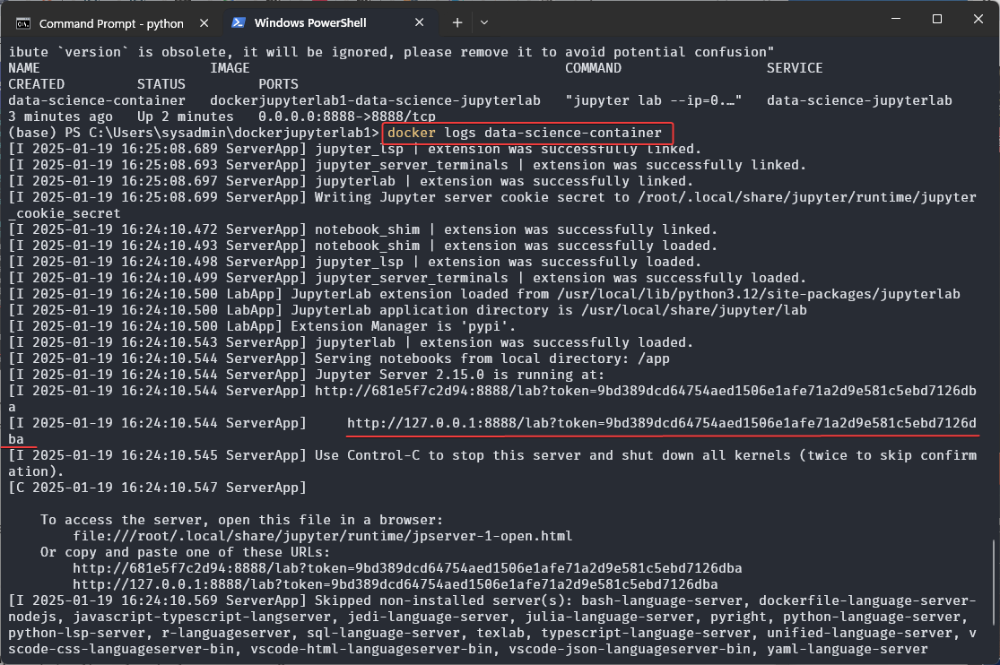
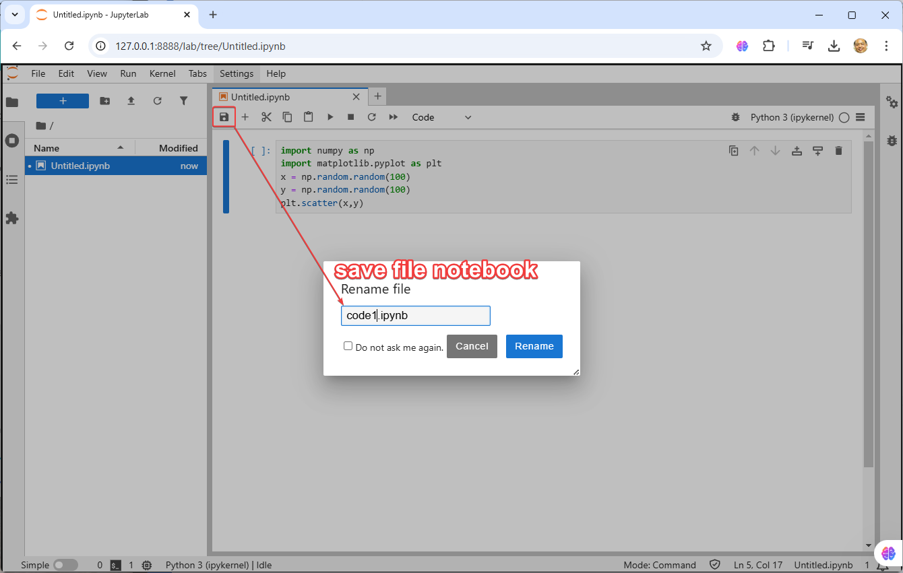

# **Section 3** Docker compose with Dockerfile

- Inside folder `dockerjupyterlab1`
- Create folder `notebooks` to keep jupyternotebook
- Create docker-compose.yml in side folder  dockerjupyterlab1

``` title="docker-compose.yml"
version: '3.8'

services:
  data-science-jupyterlab:
    build:
      context: .
      dockerfile: Dockerfile
    ports:
      - "8888:8888" # Map Jupyter Lab's port to the host
    volumes:
      - ./notebooks:/app # Mount a local directory for persistent storage of notebooks
    container_name: data-science-container
    command: ["jupyter", "lab", "--ip=0.0.0.0", "--port=8888", "--no-browser", "--allow-root"]
```
Show file browser:


```
docker compose up -d
```

The command `docker compose up -d` is used to start up a multi-container Docker application in detached mode
what it does:

1. docker compose: This is the command used to work with Docker Compose, which is a tool for defining and managing multi-container Docker applications using a docker-compose.yml file.

2. up: This command is used to create and start the containers defined in the docker-compose.yml file.

3. -d (detached mode): This flag tells Docker Compose to run the containers in the background, so they don't block your terminal session.

Once this command is executed, Docker Compose will:
- Look for a docker-compose.yml file in the current directory.
- Create and start the services defined in the file.
- Run them in the background, allowing you to continue working in the terminal.

```
docker compose ps 
```


The command docker compose ps is used to list the status of containers in a Docker Compose application. It provides information about the containers that are running, as defined in your docker-compose.yml file.
Here’s what it does:

1. **docker compose**: This is the command for managing multi-container applications using Docker Compose.

2. **ps**: This command shows the status of the containers (running or stopped) that are part of the Docker Compose application.

When you run docker compose ps, it typically displays the following information:

- Container Name: The name of the container.
- State: Whether the container is up or stopped.
- Ports: The ports exposed by the container and how they are mapped to the host.
- Service Name: The name of the service as defined in the docker-compose.yml.

### Get Token by run command 

```
docker log data-science-container
```


- url http://127.0.0.1:8888/lab?token=9bd389dcd64754aed1506e1afe71a2d9e581c5ebd7126dba


Click open notebook 


command use tab to autocomplet module suggession 

press tab after "."

``` title="code1.ipynb"
import numpy as np
import matplotlib.pyplot as plt
x = np.random.random(100)
y = np.random.random(100)
plt.scatter(x,y)
```

Save file name:


Play notebook:


Save output to folder notebooks in system


## Discuss:


## Summary: Sharing development with teams

**JupyterLab** offers several benefits when it comes to sharing code among developers, particularly in collaborative data science and development environments:

1. **Interactive Development**: JupyterLab allows for interactive coding, where developers can experiment with code, view results instantly, and refine their work step-by-step. This facilitates better collaboration, as code execution and results are shared in real-time.

2. **Notebooks for Documentation and Code**: Jupyter Notebooks combine code, visualizations, and markdown in one place. This makes it easier for developers to document their work alongside the code, creating a shared understanding of the project.

3. **Version Control Integration**: JupyterLab integrates with version control systems like Git. This makes it easier for developers to share, track changes, and collaborate on the same project without worrying about overwriting code or losing work.

4. **Live Collaboration**: Through extensions like JupyterLab Google Drive and JupyterLab RTC, multiple developers can work on the same notebook simultaneously. This real-time collaboration reduces the time needed for feedback loops and allows for better synchronization among team members.

5. **Environment Consistency**: With features like JupyterHub, teams can create consistent development environments. Developers can run their notebooks in a shared environment that mirrors production, ensuring code runs the same way across all systems.

6. **Easy Sharing and Deployment**: Developers can export notebooks as scripts, HTML, or PDF files, and easily share them with others. This makes it simple to distribute code, share results, or present findings to non-developers.

7. **Rich Data Visualization**: JupyterLab integrates well with various visualization libraries (e.g., Matplotlib, Seaborn, Plotly), enabling developers to visualize data as they work. This shared visual context helps others better understand the work.

8. **Extensibility**: Developers can add extensions to JupyterLab, such as code linters, debuggers, and integrated terminals. This customization enables teams to tailor the development environment to their needs and improve collaborative efficiency.

In summary, JupyterLab is beneficial for shared code development because it combines interactive coding, documentation, version control, and live collaboration, all within a flexible and extensible environment. This fosters productivity and streamlines collaboration among developers.


## Clone Example Git Repository 
Repository
```
git clone https://github.com/opendevbook/dockerjupyterlab
```